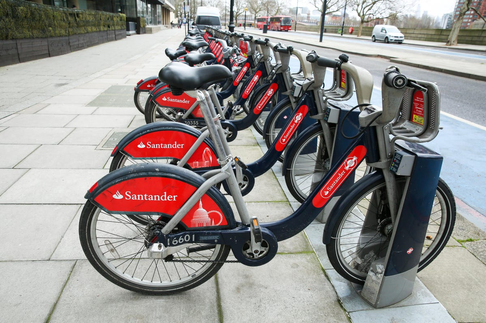

```{r setup, include=FALSE}
knitr::opts_chunk$set(echo = FALSE)
```

```{r include=FALSE}
library(knitr)
```


# Introduction

As human populations are rising across the world, so is the proportion of people that live in urban areas. Estimates from the *UN World Urbanization Prospects* indicate that over 4.2 billion people (55% of the global population) currently live in urban areas, and by 2050, an additional 2.5 billion people (68% of the global population) could be living in urban areas^[United Nations, Department of Economic and Social Affairs, Population Division (2018). World Urbanization Prospects: The 2018 Revision, Online Edition.]. More people living in urban areas calls for more space-, cost-, and energy-efficient systems of transportation as an alternative to cars. One such promising transportation alternative is the implementation of bicycle sharing programs.     

Bicycle sharing programs are transportation schemes that allow individuals to rent bicycles on a short-term basis for either a set rate or for free. Most bicycle sharing programs have many computer-controlled bicycle rack ``hubs" dispersed across a city that keep bikes locked and release them for use when a user enters the appropriate information/payment from a station or an app (Figure 1). A user can then ride the bike and return it to any other bicycle hub that is part of the same program. Many cities across the world have begun implementing bicycle sharing programs, including Chapel Hill, which has a Tar Heel Bikes sharing system^[https://move.unc.edu/bike/bikeshare/]. Systems like these provide convenient, inexpensive, and eco-friendly transportation options for individuals residing in a city.    

```{r bike-img, fig.align = 'center', out.width = "50%", fig.cap = "A `hub' of bicycles belonging to the Santander Cycles system in London. SOPA Images/Lightrocket via Getty Images"}

```

Successful implementations of bike sharing programs depend on proper management of these systems. It is important for a bike sharing program to provide a stable supply of rental bikes to its population so its users feel that they can rely on the system for their transportation needs. The analysis of bike sharing data allows for a better understanding of the demand of rental bikes in a city, which, in turn, can help inform a city about how to provide appropriate supplies of rental bikes for its population.

For our project, we were interested in predicting the number of bikes rented within a given bike sharing system given information about weather, time of day, and date. We were also interested in assessing the most important variables for predicting bike rental counts. Answer these questions, we fit and evaluated a negative binomial generalized mixed model and a random forest model, using data from three publicly available bike sharing demand datasets.      

The first dataset we use is a London bike sharing demand dataset downloaded from Kaggle^[https://www.kaggle.com/datasets/hmavrodiev/london-bike-sharing-dataset] and provided by Transport for London^[https://cycling.data.tfl.gov.uk]. This dataset contains hourly bike rental count observations over two years, from Jan 04 2015 - Jan 03 2017. The first full consecutive year of data was used as the training set in the analysis, and the second full consecutive year of data was held out as a test set in the analysis.     

The second dataset we use is a Seoul bike sharing demand dataset downloaded from the UCI Machine Learning Repository^[https://archive.ics.uci.edu/ml/datasets/Seoul+Bike+Sharing+Demand] and provided by the Seoul Metropolitan Government^[https://data.seoul.go.kr]. This dataset contains hourly bike rental counts over one year, from Dec 1 2017 - Nov 30 2018. This was used as an independent test set in the analysis.     

The third dataset we use is a Washington, D.C. bike sharing demand dataset downloaded from Kaggle^[https://www.kaggle.com/datasets/marklvl/bike-sharing-dataset] and provided by Capital Bikeshare^[https://ride.capitalbikeshare.com/system-data]. This dataset contains hourly bike rental counts over two years, from Jan 01 2011 - Dec 31 2012. This was used as an independent test set in the analysis.     

Each dataset contained hourly observations of bike rental count data. To simplify our analysis, we chunked the hourly data into three time blocks: [0:00 - 8:00), [8:00 - 16:00), and [16:00 - 24:00). Additionally, because temperature and humidity can be correlated with time of day, we chose to use the maximum and minimum daily temperature and humidity measurements for each 8-hour data point.     

There were 11 total variables that were shared among all three datasets and used to predict bike counts. Each dataset was processed such that the data units and variables were consistent across sets.

```{r echo=TRUE}
if(!require("bikeSharing", quietly = TRUE))
  install.packages("package/bikeSharing_1.0.0.tar.gz", repos = NULL)
library(bikeSharing)
```

```{r echo=TRUE}
str(london)
```

```{r echo=TRUE}
dim(seoul)
dim(dc)
```

```{r echo=TRUE}
london_train <- london[london$Year == "Year 1",]
london_test <- london[london$Year == "Year 2",]
```


# Methods

## Negative Binomial Generalized Linear Mixed Model

## Machine learning models

Next, we applied two machine learning methods to predict the bike count. The first model we used is a conditional inference tree. In traditional partitioning, all possible splits are investigated to find the best split, which results in overfitting and selection. The conditional inference tree embeds the partition step with a permutation test, thereby enabling this method to be robust to covariates of different scales. Furthermore, it is capable of stopping when no significant correlation exists between the covariates and the response (Hothorn, Hornik, and Zeileis 2006). We emplyed the ctree funciton in the partykit to fit the conditional inference tree.

We visualized the three layer conditional inference tree in order to verify the relationship between bike count and variables. It is apparent that people tend to rent fewer bikes between midnight and 8 am. Maximum temperatures and humidity also affect bike rental rates. The splits that are employed in the conditional reference tree provide well reasoned explanations of the data structure, which means high accuracy predictions are made.

```{r,echo=FALSE,warning=FALSE,message=FALSE,fig.width=5,fig.height=3,fig.align='center'}
library(devtools)
load_all("/Users/chenjiawen/Documents/Github/bios735-group1/package/bikeSharing")
london_train <- london[london$Year == "Year 1",]
london_test <- london[london$Year == "Year 2",]
library(caret)
library(ggplot2)
library(tidyverse)
library(egg)
library(data.table)
library(randomForest)
library(partykit)
# conditional inference tree
train_factor = london_train %>%
  mutate(Date=as.numeric(as.factor(Date)),
         Hour_chunks=as.factor(Hour_chunks),
         Is_weekend=as.factor(Is_weekend),
         Season=as.factor(Season),
         Is_holiday=as.factor(Is_holiday),
         Rain_or_snow=as.factor(Rain_or_snow))
  
test_factor = london_test %>%
  filter(Date!="02-29")%>%
  mutate(Date=as.numeric(as.factor(Date)),
         Hour_chunks=as.factor(Hour_chunks),
         Is_weekend=as.factor(Is_weekend),
         Season=as.factor(Season),
         Is_holiday=as.factor(Is_holiday),
         Rain_or_snow=as.factor(Rain_or_snow))

set.seed(735)
ctree0=ctree(Bike_count ~ Hour_chunks + Min_temp + Max_temp + Min_humidity + Max_humidity + Wind_speed +
                         Rain_or_snow + Is_weekend + Season + Is_holiday + Date,  
             data = train_factor,control=ctree_control(maxdepth = 3))

plot(ctree0,gp = gpar(fontsize = 6,font=2),     # font size changed to 6
  inner_panel=node_inner,
  ip_args=list(
       abbreviate = FALSE, 
       id = FALSE))
set.seed(735)
ctree0=ctree(Bike_count ~ Hour_chunks + Min_temp + Max_temp + Min_humidity + Max_humidity + Wind_speed +
                         Rain_or_snow + Is_weekend + Season + Is_holiday+Date,  
             data = train_factor)

ctree_mda=varimp(ctree0)
ctree_mda=data.table(var=names(ctree_mda),mda=ctree_mda)
setorder(ctree_mda,-mda)
colnames(ctree_mda)=c("Variable","Mean decrease in accuracy")
```

A random forest model was then applied to predict the number of bikes that would be rented. Random forest is composed of many decision trees as opposed to a single tree, resulting in a more accurate result. Incorporating the randomness allows random forest to protect against overfitting and can be applied more effectively to other data sets. The disadvantage of the random forest is its computational complexity. To fit the random forest, we used the train function within the carest package. The optimal tuning parameter mtry was determined using a 5-fold cross validation. We visualized a random selected tree. 

```{r,echo=FALSE,warning=FALSE,message=FALSE,fig.width=5,fig.height=4,fig.align='center'}
x = train_factor %>%dplyr::select(-Year,-Bike_count)
##y=unlist(seoul_data%>%%>%select(Bike_count))
y= unlist(train_factor%>% ungroup()%>%dplyr::select(Bike_count)) ## I had to add ungroup() for this to work on my 
set.seed(735)
trCtl <- trainControl(method="cv", number=5, savePredictions=TRUE)
rf_fit <- train_random_forest(data = london_train)
set.seed(735)
model1 <- randomForest(Bike_count ~ Hour_chunks + Min_temp + Max_temp + Min_humidity + Max_humidity + Wind_speed+Rain_or_snow + Is_weekend + Season + Is_holiday+Date,data = train_factor, importance=TRUE, ntree=500,mtry = 7)
reprtree:::plot.getTree(model1,k=sample(1:500,1),depth=4,cex=1,font=2)
```

Random forest sample trees share similar splits with conditional inference trees. The estimated bike rental count is much higher in the hour chunks that are not 0-8am. Additionally, the estimated count is high when the temperature is more than 22.25 degrees.

### Variable Importance in machine learning models
To investigate which variables affect the prediction most, we calculate the importance of the variables in the conditional inference tree and the random forest. In conditional inference tree, we calculated the mean decrease in accuracy when deleting a variable.

```{r,echo=F}
knitr::kable(ctree_mda)
```

In random forest, we calculte the increase in MSE when deleting a variable.

```{r echo=FALSE, message=FALSE, warning=FALSE,fig.width=5,fig.height=4,fig.align='center'}
plot_rf_importance(london_train)
```

The top important variables of the conditional inference tree and random forest are similar. The hour chunk is the most important variable in both models. Additionally, the maximum temperature has a significant impact on the model prediction. Additional details of the variables are discussed in the discussion section. We further compare the performance of random forest and conditional inference tree using the second year bike renting data in London. Conditional inference tree results in a $R^2=0.81$ and random forest has $R^2=0.91$. Due the similarity in these two models, we selected random forest tree in the further comparison.


# Results 

## Negative Binomial Generalized Linear Mixed Model
```{r eval=FALSE, include=TRUE}
glmm_fit <- MCEM_algorithm( beta_initial = c(8.3, 1.5, 1.5, -0.25, -0.50, 0, 
                                             0, -0.25, 0, 0, 0, 0, 0, -0.25),
                         theta_initial = 10,
                         s2gamma_initial = 0.2,
                         M = 1000,
                         burn.in = 200,
                         tol = 10^-4,
                         maxit = 100,
                         data = london_train
                         )
```
```{r echo=TRUE}
str(glmm_fit)
```
```{r echo=TRUE}
glmm_model_fit(glmm_fit, london_train, scale_to_reference_mean = "no", 
               reference = london)
glmm_model_fit(glmm_fit, london_test, scale_to_reference_mean = "no",
               reference = london)
glmm_model_fit(glmm_fit, dc, scale_to_reference_mean = "yes",
               reference = london)
glmm_model_fit(glmm_fit, seoul, scale_to_reference_mean = "yes",
               reference = london)
```


## Random Forest
```{r echo=TRUE, message=FALSE, warning=FALSE}
rf_fit <- train_random_forest(data = london_train)
rf_fit
```

```{r echo=TRUE, message=FALSE, warning=FALSE}
plot_rf_importance(london_train)
```

```{r echo=TRUE}
rf_model_fit(rf_fit, london_train, scale_to_reference_mean = "no", 
             reference = london)
rf_model_fit(rf_fit, london_test, scale_to_reference_mean = "no", 
             reference = london)
rf_model_fit(rf_fit, dc, scale_to_reference_mean = "yes", 
             reference = london)
rf_model_fit(rf_fit, seoul, scale_to_reference_mean = "yes", 
             reference = london)
```


```{r message=FALSE, warning=FALSE}
seoul$city = "Seoul - Scaled"
london_train$city = "London"
london_test$city = "London"
dc$city = "DC - Scaled"
seoul$city2 = "Seoul - Scaled"
london_train$city2 = "London - Train"
london_test$city2 = "London - Test"
dc$city2 = "DC - Scaled"
scale_seoul = mean(seoul$Bike_count)/
  mean(london$Bike_count)
scale_dc = mean(dc$Bike_count)/
  mean(london$Bike_count)
seoul$Bike_count2 = seoul$Bike_count / scale_seoul
london_test$Bike_count2 = london_test$Bike_count 
london_train$Bike_count2 = london_train$Bike_count 
dc$Bike_count2 = dc$Bike_count / scale_dc
seoul$Year = 1


all_data = rbind(seoul, london_train, london_test, dc)
all_data$city = factor(all_data$city, 
                       levels = c("London",  "DC - Scaled", "Seoul - Scaled"))
all_data$city2 = factor(all_data$city2, 
                        levels = c("London - Train", "London - Test", 
                                   "DC - Scaled", "Seoul - Scaled"))

ggplot(all_data, aes(x = Bike_count2)) + 
  geom_histogram(fill = "dark blue", aes(y = stat(density))) + 
  facet_wrap(~city) + theme_classic() + xlim(0,30000) + 
  labs(title = "Distribution of Bike Counts for Cities", 
       y = "Density", x = "Bike Count")

ggplot(all_data, aes(x = Bike_count2)) + 
  geom_histogram(fill = "dark blue", aes(y = stat(density))) + 
  facet_wrap(~city2) + theme_classic() + xlim(0,30000) + 
  labs(title = "Distribution of Bike Counts for Cities", 
       y = "Density", x = "Bike Count")

mean(london_test$Bike_count)
mean(london_train$Bike_count)

```


# Discussion


# Reference
Hothorn T, Hornik K, Zeileis A (2006). “Unbiased Recursive Partitioning: A Conditional
Inference Framework.” Journal of Computational and Graphical Statistics, 15(3), 651–674.
doi:10.1198/106186006X133933.


